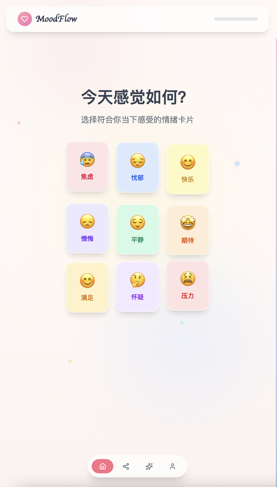

# MoodFlow - 情绪追踪应用 | Mood Tracking App

<p align="center">
  
</p>

<p align="center">
  <b>中文</b> | <a href="#english">English</a>
</p>

<p align="center">
  一个温暖、直观的情绪记录与自我关怀应用
  <br />
  A warm and intuitive mood tracking & self-care application
</p>

<p align="center">
  <a href="https://github.com/yourusername/moodflow/stargazers">
    
  </a>
  <a href="https://github.com/yourusername/moodflow/blob/main/LICENSE">
    
  </a>
  <a href="https://react.dev">
    
  </a>
  <a href="https://www.typescriptlang.org">
    
  </a>
</p>

## 📸 截图展示 | Screenshots

<div align="center">

### 🏠 情绪打卡首页 | Mood Check-in


### 💬 分享与邀请 | Share & Invite


### 👤 个人中心与成就 | Profile & Achievements


</div>

## ✨ 功能特性

### 🎭 情绪记录
- **9种情绪状态**：焦虑、忧郁、快乐、懊悔、平静、期待、满足、怀疑、压力
- **6大生活场景**：居家、独处、工作、通勤、恋爱、社交
- **智能打卡限制**：1小时内自动提醒，避免无效重复记录

### 🎯 场景化活动推荐
- 根据**情绪+场景**组合，智能推荐3个专属疗愈活动
- 每个场景配备4+个精心设计的心理调节活动
- 活动涵盖：呼吸练习、冥想、 journaling、运动、音乐疗愈等

### 🤖 AI 情绪建议
- 基于情绪模式的个性化洞察
- 即时情绪调节技巧
- 长期心理健康建议

### 📊 数据统计与分享
- 情绪分布统计
- 连续打卡天数
- 周/月趋势分析
- 支持导出 CSV 数据

### 💾 本地数据持久化
- 所有数据存储在浏览器 localStorage
- 无需注册，保护隐私
- 刷新页面数据不丢失

## 🚀 快速开始

### 环境要求
- Node.js 18+
- npm 9+

### 安装依赖
```bash
npm install
```

### 开发模式
```bash
npm run dev
```
访问 http://localhost:5173/

### 构建生产版本
```bash
npm run build
```

### 预览生产版本
```bash
npm run preview
```

## 🏗️ 技术栈

- **框架**: React 19.2 + TypeScript 5.9
- **构建工具**: Vite 7.2
- **UI 组件**: Radix UI + shadcn/ui
- **样式**: Tailwind CSS 3.4
- **图标**: Lucide React
- **字体**: Google Fonts (Quicksand, Pacifico)

## 📁 项目结构

```
src/
├── components/          # 可复用组件
│   ├── ui/             # shadcn/ui 基础组件
│   └── GentleReminder.tsx  # 温和提醒弹窗
├── sections/           # 页面区块组件
│   ├── MoodSelector.tsx    # 情绪选择
│   ├── SceneSelector.tsx   # 场景选择
│   ├── ActivityRecommendations.tsx  # 活动推荐
│   ├── SocialShare.tsx     # 社交分享
│   └── AIAdvice.tsx        # AI建议
├── hooks/              # 自定义 Hooks
│   ├── useMoodHistory.ts   # 情绪历史记录
│   ├── useCustomActivities.ts  # 自定义活动
│   └── useAIAdvice.ts      # AI建议生成
├── data/               # 静态数据
│   └── moods.ts        # 情绪、场景、活动数据
├── types/              # TypeScript 类型定义
│   └── index.ts
├── test/               # 测试工具
│   ├── auto-check.tsx  # 自动化检查
│   └── logic-tests.ts  # 业务逻辑测试
├── App.tsx             # 主应用组件
└── main.tsx            # 应用入口
```

## 🎯 核心功能逻辑

### 1小时打卡限制
```
用户打卡 → 1小时内再次打卡 → 显示温和提醒弹窗
                ↓
        ┌───────┴───────┐
        ↓               ↓
    稍后再来         仍要记录
        ↓               ↓
    重置回主页      删除旧记录
                    保存新记录
                    3秒后回主页
```

### 活动推荐算法
1. 根据情绪筛选匹配的活动
2. 根据场景进一步筛选
3. 随机排序，返回前3个
4. 无匹配时返回默认活动

## 🧪 自动化测试

项目在开发环境自动运行检查：

```typescript
// 浏览器控制台运行
MoodFlowCheck.runAllChecks()      // 运行所有检查
MoodFlowLogicTest.runLogicTests() // 运行业务逻辑测试
```

检查项包括：
- 情绪/场景数据完整性
- 活动覆盖度检查
- localStorage 状态检查
- 推荐逻辑验证

## 🎨 设计特色

- **温暖配色**：采用粉色、玫瑰色为主的柔和色调
- **流畅动画**：卡片浮动、渐变过渡、平滑滚动
- **玻璃拟态**：头部导航使用 backdrop-blur 效果
- **响应式布局**：适配桌面和移动设备

## 📝 开发规范

- **TypeScript 严格模式**：类型安全优先
- **React Hooks 规范**：遵循官方最佳实践
- **组件设计**：原子化设计，单一职责
- **性能优化**：useCallback/useMemo 合理使用

## 🔒 隐私说明

- 所有数据仅存储在浏览器本地
- 不涉及任何服务器通信
- 无用户追踪或分析

## 📄 开源协议

MIT License

## 🙏 致谢

- [shadcn/ui](https://ui.shadcn.com/) - 精美的 UI 组件
- [Radix UI](https://www.radix-ui.com/) - 无障碍组件库
- [Tailwind CSS](https://tailwindcss.com/) - 实用优先的 CSS 框架

---

## 🤝 参与贡献

我们欢迎各种形式的贡献！请参阅 [CONTRIBUTING.md](./CONTRIBUTING.md) 了解如何参与。

## 📄 开源协议

[MIT License](./LICENSE) © 2026 MoodFlow Contributors

## 🙏 致谢

- [shadcn/ui](https://ui.shadcn.com/) - 精美的 UI 组件
- [Radix UI](https://www.radix-ui.com/) - 无障碍组件库
- [Tailwind CSS](https://tailwindcss.com/) - 实用优先的 CSS 框架

---

## 🇬🇧 English Version

<details>
<summary>Click to expand English README</summary>

# MoodFlow - Mood Tracking App

A warm and intuitive mood tracking & self-care application that helps users become aware of emotional changes and receive personalized healing suggestions.

## ✨ Features

### 🎭 Mood Recording
- **9 Mood States**: Anxiety, Melancholy, Happy, Regret, Calm, Anticipation, Contentment, Doubt, Stress
- **6 Life Scenes**: Home, Alone, Work, Commute, Love, Social
- **Smart Check-in Limit**: Automatic reminder within 1 hour to avoid invalid repeated records

### 🎯 Contextual Activity Recommendations
- Smart recommendation of 3 exclusive healing activities based on **Mood + Scene** combination
- Each scene equipped with 4+ carefully designed psychological regulation activities

### 🤖 AI Mood Advice
- Personalized insights based on mood patterns
- Instant emotion regulation techniques
- Long-term mental health suggestions

### 📊 Data Statistics & Sharing
- Mood distribution statistics
- Consecutive check-in days
- Weekly/Monthly trend analysis
- Support CSV data export

### 💾 Local Data Persistence
- All data stored in browser localStorage
- No registration required, privacy protected

## 🚀 Quick Start

```bash
npm install
npm run dev
```

Visit http://localhost:5173/

## 🏗️ Tech Stack

- **Framework**: React 19.2 + TypeScript 5.9
- **Build Tool**: Vite 7.2
- **UI Components**: Radix UI + shadcn/ui
- **Styling**: Tailwind CSS 3.4

## 🤝 Contributing

We welcome contributions! Please see [CONTRIBUTING.md](./CONTRIBUTING.md) for guidelines.

## 📄 License

MIT License

</details>

---

**MoodFlow** - 关爱自己，从记录情绪开始 💝
<br />
**MoodFlow** - Care for yourself, start with recording your mood 💝
