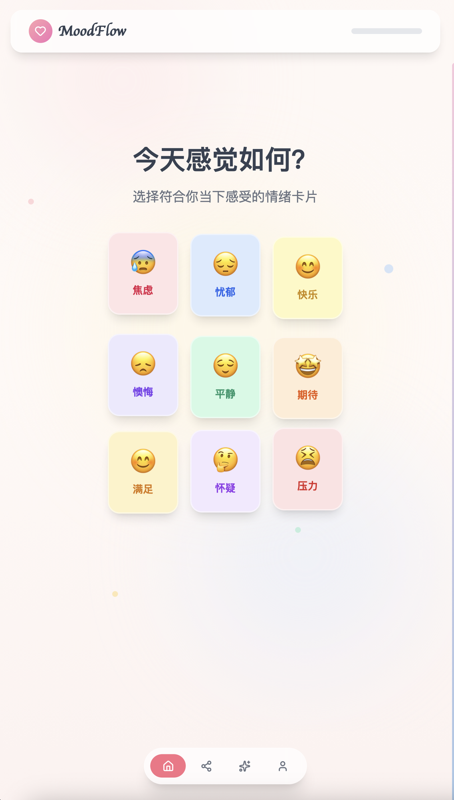
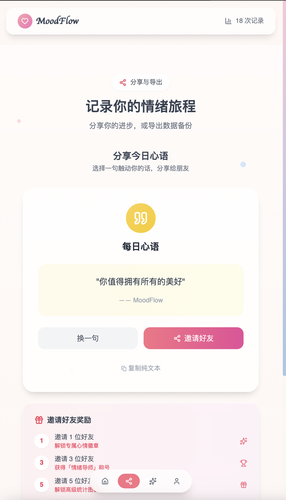
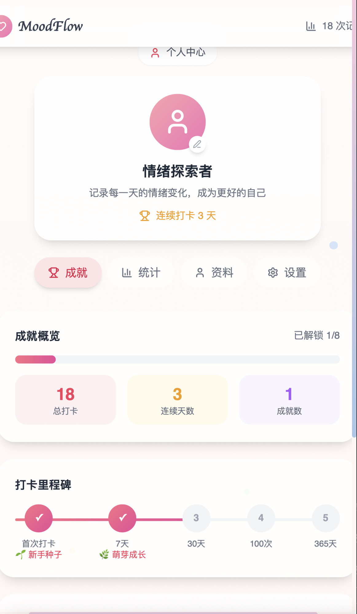

# MoodFlow - 情绪追踪应用 | Mood Tracking App

<p align="center">
  
</p>

<p align="center">
  <b>中文</b> | <a href="#english">English</a>
</p>

<p align="center">
  一个温暖、直观的情绪记录与自我关怀应用
  <br />
  A warm and intuitive mood tracking & self-care application
</p>

<p align="center">
  <a href="https://github.com/yourusername/moodflow/stargazers">
    
  </a>
  <a href="https://github.com/yourusername/moodflow/blob/main/LICENSE">
    
  </a>
  <a href="https://react.dev">
    
  </a>
  <a href="https://www.typescriptlang.org">
    
  </a>
</p>

## 📸 截图展示 | Screenshots

<div align="center">

### 🏠 情绪打卡首页 | Mood Check-in


### 💬 分享与邀请 | Share & Invite


### 👤 个人中心与成就 | Profile & Achievements


</div>

## ✨ 功能特性

### 🎭 情绪记录
- **9种情绪状态**：焦虑、忧郁、快乐、懊悔、平静、期待、满足、怀疑、压力
- **6大生活场景**：居家、独处、工作、通勤、恋爱、社交
- **智能打卡限制**：1小时内自动提醒，避免无效重复记录

### 🎯 场景化活动推荐
- 根据**情绪+场景**组合，智能推荐3个专属疗愈活动
- 每个场景配备4+个精心设计的心理调节活动
- 活动涵盖：呼吸练习、冥想、 journaling、运动、音乐疗愈等

### 🤖 AI 情绪建议
- **混合模式**：预设建议库（72条）+ DeepSeek AI 生成
- **情绪导向**：9种情绪 × 8条专业建议
- **个性化洞察**：基于打卡数据的智能分析
- **每日限额**：8次AI生成，避免过度依赖

### 💳 情绪分享卡片
- 精美渐变背景卡片
- 自定义用户落款和位置
- 情绪绑定每日心语（99条）
- 支持编辑和保存为图片

### 📚 情绪科普知识
- 9种基础情绪深度科普
- 情绪定义、成因、应对建议
- 折叠式卡片设计
- 帮助用户理解和管理情绪

### 📊 数据统计与分享
- 情绪分布统计（彩虹饼图）
- 连续打卡天数追踪
- 周/月趋势分析
- 支持导出 CSV 数据
- 每日心语社交分享

### 💾 本地数据持久化
- 所有数据存储在浏览器 localStorage
- 无需注册，保护隐私
- 刷新页面数据不丢失

## 🚀 快速开始

### 环境要求
- Node.js 18+
- npm 9+

### 安装依赖
```bash
npm install
```

### 开发模式
```bash
npm run dev
```
访问 http://localhost:5173/

### 构建生产版本
```bash
npm run build
```

### 预览生产版本
```bash
npm run preview
```

## 🔧 环境变量配置

### 本地开发
复制 `.env.example` 为 `.env` 并配置：

```bash
cp .env.example .env
```

### Vercel 部署
在项目设置中添加以下环境变量：

| 变量名 | 说明 | 示例 |
|--------|------|------|
| `VITE_DEEPSEEK_API_KEY` | DeepSeek API Key | `sk-...` |
| `VITE_DEEPSEEK_API_URL` | API 地址 | `https://api.deepseek.com/v1/chat/completions` |
| `VITE_DEEPSEEK_MODEL` | 模型名称 | `deepseek-chat` |
| `VITE_ENABLE_AI` | 启用AI功能 | `true` / `false` |
| `VITE_ENABLE_CHECKIN_LIMIT` | 打卡限制 | `true` (生产) / `false` (开发) |
| `VITE_ENABLE_AI_ADVICE_LIMIT` | AI建议限制 | `true` (生产) / `false` (开发) |
| `VITE_ENABLE_REPORT_LIMIT` | 报告生成限制 | `true` (生产) / `false` (开发) |

⚠️ **安全提醒**：不要将真实的 API Key 提交到代码仓库！

## 🏗️ 技术栈

- **框架**: React 19.2 + TypeScript 5.9
- **构建工具**: Vite 7.2
- **UI 组件**: Radix UI + shadcn/ui
- **样式**: Tailwind CSS 3.4
- **图标**: Lucide React
- **字体**: Google Fonts (Quicksand, Pacifico)

## 📁 项目结构

```
src/
├── components/          # 可复用组件
│   ├── ui/             # shadcn/ui 基础组件
│   ├── CheckInCompleteModal.tsx  # 打卡完成弹窗
│   ├── MoodCard.tsx    # 情绪分享卡片
│   ├── DailyLimitReminder.tsx    # 打卡限制提醒
│   ├── DebugReportCount.tsx      # 调试工具（开发环境）
│   └── TestDataButton.tsx        # 测试数据生成（开发环境）
├── sections/           # 页面区块组件
│   ├── MoodSelector.tsx    # 情绪选择
│   ├── SceneSelector.tsx   # 场景选择
│   ├── ActivityRecommendations.tsx  # 活动推荐
│   ├── SocialShare.tsx     # 社交分享
│   ├── AIAdvice.tsx        # AI建议
│   ├── KnowledgeView.tsx   # 情绪科普知识
│   └── Profile.tsx         # 个人中心
├── hooks/              # 自定义 Hooks
│   ├── useMoodHistory.ts   # 情绪历史记录
│   ├── useCustomActivities.ts  # 自定义活动
│   ├── useAIAdvice.ts      # AI建议生成
│   └── useStatistics.ts    # 统计分析
├── services/           # 服务层
│   ├── aiService.ts        # DeepSeek AI 服务
│   └── reportService.ts    # 周报月报服务
├── data/               # 静态数据
│   ├── moods.ts            # 情绪、场景、活动数据
│   ├── emotionKnowledge.ts # 情绪科普数据
│   └── activityDatabase.ts # 活动数据库
├── types/              # TypeScript 类型定义
│   └── index.ts
├── App.tsx             # 主应用组件
└── main.tsx            # 应用入口
```

## 🎯 核心功能逻辑

### 打卡流程
```
选择情绪 → 选择场景 → 活动推荐 → 完成打卡
                                           ↓
                              显示成功弹窗（5秒）
                                           ↓
                              自动返回主页，重置状态
```

### 1小时打卡限制
同一场景1小时内重复打卡会显示提醒，用户可选择：
- **稍后再来**：返回主页
- **仍要记录**：删除旧记录，保存新记录

### 活动推荐算法（Gross 情绪调节理论）
1. 根据情绪筛选匹配的活动
2. 根据场景进一步筛选
3. 确保覆盖前因聚焦、反应调节、注意力分配等策略
4. 随机排序，返回3个活动

### AI建议生成逻辑
1. **预设优先**：从72条情绪导向建议库中智能选择
2. **避免重复**：记录最近推荐，不重复推送
3. **AI兜底**：每日8次额度，调用 DeepSeek API 生成
4. **趋势感知**：根据最近3条记录分析情绪趋势

## 🧪 自动化测试

项目在开发环境自动运行检查：

```typescript
// 浏览器控制台运行
MoodFlowCheck.runAllChecks()      // 运行所有检查
MoodFlowLogicTest.runLogicTests() // 运行业务逻辑测试
```

检查项包括：
- 情绪/场景数据完整性
- 活动覆盖度检查
- localStorage 状态检查
- 推荐逻辑验证

## 🎨 设计特色

- **温暖配色**：采用粉色、玫瑰色为主的柔和色调
- **流畅动画**：卡片浮动、渐变过渡、平滑滚动
- **玻璃拟态**：头部导航使用 backdrop-blur 效果
- **响应式布局**：适配桌面和移动设备

## 📝 开发规范

- **TypeScript 严格模式**：类型安全优先
- **React Hooks 规范**：遵循官方最佳实践
- **组件设计**：原子化设计，单一职责
- **性能优化**：useCallback/useMemo 合理使用

## 🔒 隐私与安全

### 数据存储
- 所有数据仅存储在浏览器 localStorage
- 不涉及任何服务器通信（除 DeepSeek API 调用）
- 无用户追踪或分析

### API 安全
- API Key 通过环境变量注入，不暴露在前端代码
- 生产环境必须配置 `VITE_ENABLE_AI=true` 才能启用 AI 功能
- 建议启用限额保护，避免 API 滥用

### 环境变量安全
```bash
# 开发环境（本地）
.env                    # 被 .gitignore 忽略，安全
.env.local             # 本地覆盖，不提交

# 生产环境（Vercel）
在 Vercel Dashboard 中配置环境变量
```

## 📄 开源协议

MIT License

## 🙏 致谢

- [shadcn/ui](https://ui.shadcn.com/) - 精美的 UI 组件
- [Radix UI](https://www.radix-ui.com/) - 无障碍组件库
- [Tailwind CSS](https://tailwindcss.com/) - 实用优先的 CSS 框架

---

## 🤝 参与贡献

我们欢迎各种形式的贡献！请参阅 [CONTRIBUTING.md](./CONTRIBUTING.md) 了解如何参与。

## 📄 开源协议

[MIT License](./LICENSE) © 2026 MoodFlow Contributors

## 🙏 致谢

- [shadcn/ui](https://ui.shadcn.com/) - 精美的 UI 组件
- [Radix UI](https://www.radix-ui.com/) - 无障碍组件库
- [Tailwind CSS](https://tailwindcss.com/) - 实用优先的 CSS 框架

---

## 🇬🇧 English Version

<details>
<summary>Click to expand English README</summary>

# MoodFlow - Mood Tracking App

A warm and intuitive mood tracking & self-care application that helps users become aware of emotional changes and receive personalized healing suggestions.

## ✨ Features

### 🎭 Mood Recording
- **9 Mood States**: Anxiety, Melancholy, Happy, Regret, Calm, Anticipation, Contentment, Doubt, Stress
- **6 Life Scenes**: Home, Alone, Work, Commute, Love, Social
- **Smart Check-in Limit**: Automatic reminder within 1 hour to avoid invalid repeated records

### 🎯 Contextual Activity Recommendations
- Smart recommendation of 3 exclusive healing activities based on **Mood + Scene** combination
- Each scene equipped with 4+ carefully designed psychological regulation activities

### 🤖 AI Mood Advice
- Personalized insights based on mood patterns
- Instant emotion regulation techniques
- Long-term mental health suggestions

### 📊 Data Statistics & Sharing
- Mood distribution statistics
- Consecutive check-in days
- Weekly/Monthly trend analysis
- Support CSV data export

### 💾 Local Data Persistence
- All data stored in browser localStorage
- No registration required, privacy protected

## 🚀 Quick Start

```bash
npm install
npm run dev
```

Visit http://localhost:5173/

## 🏗️ Tech Stack

- **Framework**: React 19.2 + TypeScript 5.9
- **Build Tool**: Vite 7.2
- **UI Components**: Radix UI + shadcn/ui
- **Styling**: Tailwind CSS 3.4

## 🤝 Contributing

We welcome contributions! Please see [CONTRIBUTING.md](./CONTRIBUTING.md) for guidelines.

## 📄 License

MIT License

</details>

---

**MoodFlow** - 关爱自己，从记录情绪开始 💝
<br />
**MoodFlow** - Care for yourself, start with recording your mood 💝
